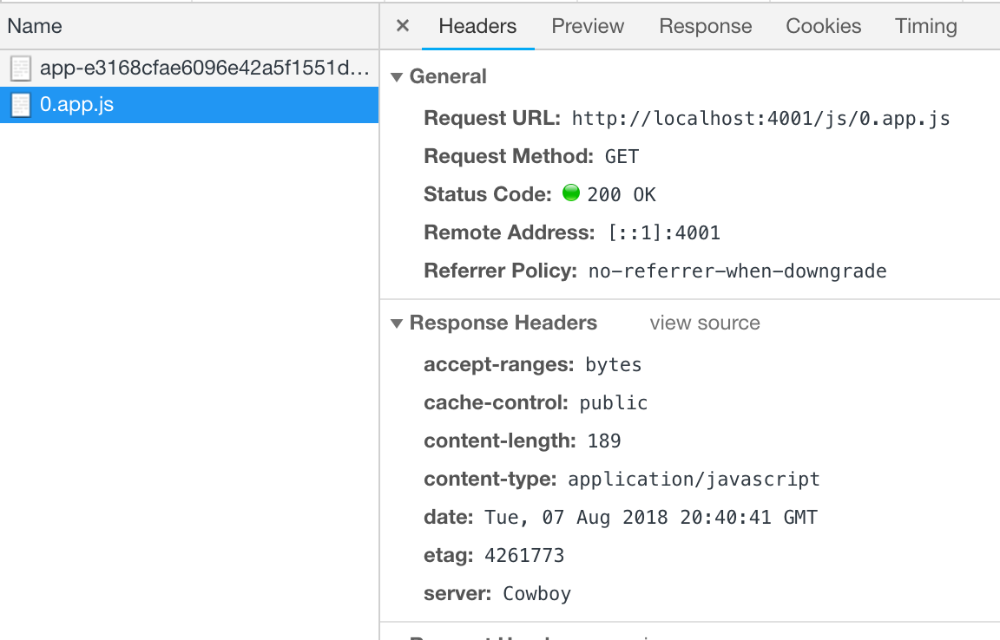

# Webpack Code Splitting with Phoenix Digest

## Background

Webpack enables [dynamic importing and automatically generated chunks](https://webpack.js.org/guides/code-splitting/#dynamic-imports). This make automatic code splitting very easy for SPAs.

However, although seemly working with fine with Phoenix, the automatically generated webpack chunks are not digested. This repo demostrate the issue.

Make sure you clone this repo in the [development phoenix](https://github.com/phoenixframework/phoenix#generating-a-phoenix-project-from-unreleased-versions)'s installer folder for the official webpack support in the unreleased Phoenix version.

## Development

In development everything should look normal since nothing is digested. When going to http://localhost:4000 you should see a magical "Loaded" message in your console.

## Problem in Production

Now the issue comes in in the production version:

1.  Compile the production server: `MIX_ENV=prod mix compile` to compile
2.  Build assets: `cd assets; webpack --mode production`
3.  Digest assets: Back into the repo folder and run `mix phx.digest`
4.  Start server: `PORT=4001 MIX_ENV=prod mix phx.server`
5.  Go to http://localhost:4001.

In the console you will still see the magical `Loaded` message. But when you inspect the network you will see a undigested version of chunk file was used.

